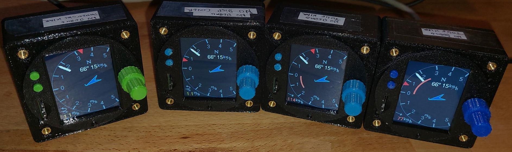
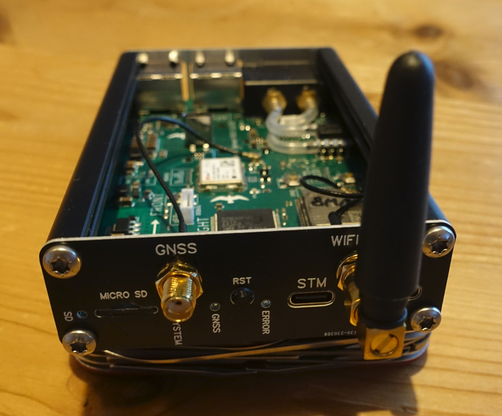
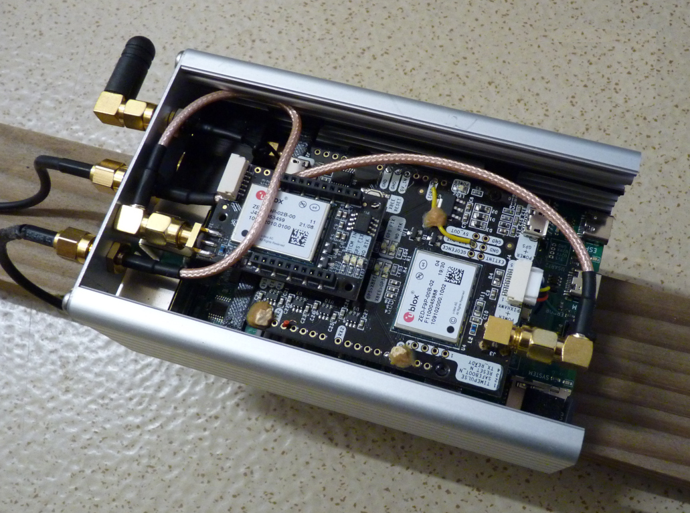

### Larus Flight Information Data System for Gliders ###

This project provides hardware and software to create a **Data-Acquisition and Presentation System** for **Gliders** including data output to **Flight Management Systems** like [XCsoar](https://github.com/XCSoar).

The core component is a **INS-augmented satellite variometer**.

The **Larus display** is used to provide the essential information for glider pilots without unneccesary overhead.

### Overview
- The documentation starting point is here: https://github.com/larus-breeze/doc_larus

### Frontend
- 57mm display unit. With transflective 2" display or a round 2.1" Display, STM32H7 and Rust firmware. 

### Sensor

Sensor hardware containing an **IMU**, **pressure sensors** and a **(D-)GNSS**
The sensor firmware is providing essential information for glider navigation like

  - **Position (Precision GNSS)**,
  - **AHRS** = Attitude including true heading, optionally with D-GNSS satellite-based heading
  - GNSS/INS-based **ultra-fast variometer**
  - **Real-time wind measurement**
  - **Air-density** measurement
  - Automatic **3D high precision compass calibration**
  - Worldwide automatic adaption to the local **magnetic induction parameters** using NOAA data
  - Connectivity via **CAN, Bluetooth or WLAN, RS232 and USB**

<!--  -->
The Larus project maintains a Software-In-The-Loop **SIL-Simulator** to test and qualify algorithms.

Some more details about the features can be found under [algorithms](https://github.com/larus-breeze/sw_sensor_algorithms).

The sensor unit can also be used as a universal data logger for manned or UAV test flights with a sampling-rate of 100 Hz.
The logger can write it's data to a micro-sd with a virtually unlimited capacity.

**Fully assembled unit with single GNSS**

**DGNSS (Sat Compass) Larus Sensor**

<!--  -->
Our logo comes from: Ludovic Péron, CC BY-SA 3.0

