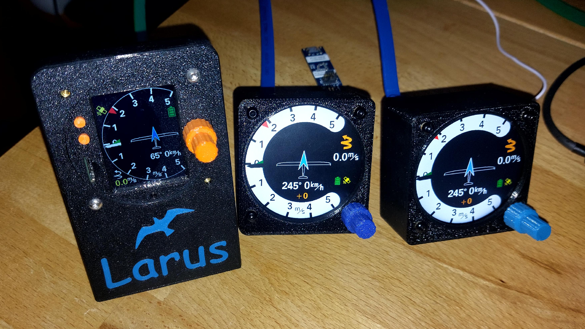

### Larus Flight Information Data System for Gliders ###

This project provides hardware and software to create a **Data-Acquisition and Presentation System** for **Gliders** including data output to **Flight Management Systems** like [XCsoar](https://github.com/XCSoar).

### Overview
- The documentation starting point is here: https://github.com/larus-breeze/doc_larus

### Frontend
- 57mm display unit. With transflective 2" display, STM32H7 and Rust firmware. 

### Sensor
https://github.com/larus-breeze/hw_sensor, https://github.com/larus-breeze/sw_sensor
Sensor hardware containing an **IMU**, **pressure sensors** and a **(D-)GNSS**
The sensor firmware is providing essential information for glider navigation like 

  - **position**, 
  - **AHRS** = attitude including true heading, optionally with D-GNSS satellite-based heading
  - GNSS/INS-based ultra-fast **variometer**, 
  - **real-time wind measurement**,
  - **air-density** measurement
  - worldwide automatic adaption to the local **magnetic induction parameters** using NOAA data.
  - coming soon: **3D high precision calibration** for the compass sensor

**
Automatic in-flight compass sensor calibration
**
  
<!--  -->
Software-In-The-Loop (**SIL**)-Simulator to test and qualify algorithms 

Some more details about the features can be found under [algorithms](https://github.com/larus-breeze/sw_sensor_algorithms).

The sensor unit can also be used as a universal data logger for manned or UAV test flights with a sampling-rate of 100 Hz. The logger writes it's data to a micro-sd with a virtually unlimited capacity. The **Larus avionics system** is connected via a **CAN bus**.

**Fully assembled unit with single GNSS**

**DGNSS (Sat Compass) Larus Sensor**

